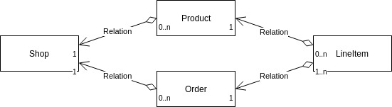

# Shopify Developer Intern Challenge - Winter 2019
Demo project for Shopify Developer Intern [Challenge](https://docs.google.com/document/d/1YYDRf_CgQRryf5lZdkZ2o3Hm3erFSaISL1L1s8kLqsI/edit) - Winter 2019.

## High Level Design


## Technologies
* Java
* Spring Boot
* Hibernate + H2 [in memory database]

## Rest API

Rest API [documentation](https://web.postman.co/collections/4982417-ea4dde06-afc2-47e4-8d2e-9ae0e5e51386?workspace=06f9c32e-db27-43c8-8474-4b62798ee331#3f7f2f24-3029-4535-99f6-3105d46267b0).

## How to use it

Run the following to start the container:

```
sudo docker run -tdi -p 8080:8080 pfeitosa/shopify-intern-challenge-2019
```
